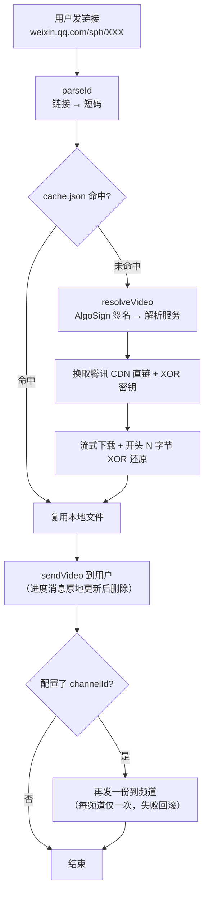

# 微信视频号下载机器人

Telegram 机器人 + 命令行工具，输入微信视频号分享链接即可下载视频。机器人部署在本机，通过 Telegram 使用，视频按短码缓存存储在本机 `~/Downloads/wx-videos`。

## 功能

- **Telegram 机器人**：私聊发链接直接下载；群聊自动识别微信视频号链接（无需 @），非微信链接静默忽略
- **回复式交互**：视频与进度消息回复到用户发的那条消息，一一对应；群聊还会 @ 原消息发送人触发提醒
- **视频标题**：视频消息显示标题，群聊时为「标题 + @发送人」
- **原文件按钮**：视频下方「获取原文件 x.x MB」按钮，点击发送未压缩原始文件（真实文件名）
- **频道同步**：配置 `channelId` 后，每个视频会同时发一份到指定 Telegram 频道存档（同一视频只同步一次）；频道里同样能点「获取原文件」
- **历史补发**：`--backfill` 把上线前已下载的视频陆续补发到频道，可分批、可续跑，且与常驻机器人同时运行
- **离线补处理**：服务停机期间发的链接，启动后自动补处理，延迟处理的视频标题标注「（补发）」
- **多链接**：一条消息可包含多个链接，逐个下载；重复链接自动去重
- **视频缓存**：同一视频（按短码识别）只下载一次；同名文件先校验大小，一致直接复用
- **并发处理**：多任务并发执行（`maxTasks` 可配），达到上限回复排队位置；同一视频并发去重
- **进度消息**：解析/下载状态原地更新同一条消息，视频发出后才删除，不留中间消息
- **白名单**：可选限制使用人（配置文件动态生效，无需重启）
- **命令行工具**：`wxdl.mjs` 支持同样的解析下载

## 环境要求

| 依赖 | 要求 | 说明 |
|---|---|---|
| Node.js | 18+（推荐 20+，实测 v24） | 用到内置 `fetch`、WebStreams、顶层 `await`、`node:crypto`；**无任何 npm 依赖**，不需要 `npm install` |
| ffprobe（ffmpeg） | 建议安装 | 读取视频真实尺寸随上传发送，避免 Telegram 把竖屏视频显示成方图比例；缺失时降级为旧行为 |
| 代理 | 需要 | 访问 Telegram API（默认读 `http_proxy`/`https_proxy`，或配置 `proxy` 字段）；视频下载走直连 |
| 平台 | macOS 为主 | `bot.sh` 的 launchd 开机自启是 macOS 专用；其他平台直接 `node bot.mjs` 前台运行即可 |

## 目录结构

```
wx-video/
├── bot.mjs            # Telegram 机器人主程序（轮询/任务池/发送/频道同步/补发）
├── lib.mjs            # 解析/下载核心（链接解析、签名、CDN 下载、XOR 还原）
├── wxdl.mjs           # 命令行下载工具
├── bot.sh             # 管理脚本（启动/停止/重启/状态/日志/补发/开机自启）
├── bot.config.json    # 配置（含 token，不入库）
├── bot.config.example.json  # 配置模板
├── LICENSE            # MIT
├── logs/              # 按天日志（bot-YYYY-MM-DD.log）
└── test/              # mock Telegram 端到端测试（完全离线）
```

模块职责：

| 文件 | 职责 |
|---|---|
| `lib.mjs` | 纯逻辑，可单独复用：`parseId`（链接→短码）、`resolveVideo`（签名换直链）、`downloadVideo`（流式下载 + XOR 还原）、`cleanTitle` |
| `bot.mjs` | Telegram 侧全部逻辑：长轮询、任务池、进度消息、发送/按钮、频道同步、`--backfill` 补发、索引读写与跨进程锁 |
| `wxdl.mjs` | 命令行薄封装，调用 `lib.mjs` 直接落盘 |
| `bot.sh` | 进程管理（launchd 优先）、日志、补发入口、开机自启注册 |

## 快速开始

1. **获取 token**：Telegram 里找 [@BotFather](https://t.me/BotFather) → `/newbot` → 按提示创建，拿到 token
2. **配置**：复制模板并填入 token：
   ```bash
   cd wx-video
   cp bot.config.example.json bot.config.json   # 编辑填入你的 token
   ```
3. **启动**：
   ```bash
   ./bot.sh start      # 启动
   ./bot.sh status     # 查看状态
   ./bot.sh log        # 实时查看当天日志（Ctrl+C 退出）
   ./bot.sh restart    # 重启
   ./bot.sh stop       # 停止
   ./bot.sh autostart on   # 只注册开机自启（不启动服务）
   ```

## 开机自启

```bash
./bot.sh autostart on     # 注册开机自启（登录时 launchd 自动启动）
./bot.sh autostart off    # 移除自启（运行中的服务不受影响）
./bot.sh autostart status # 查看自启状态
```

**启动服务和开机自启是两件事**：`autostart on` 只注册（下次登录自动启动），需要现在运行请单独 `./bot.sh start`。

> 实现说明：通过系统级 LaunchAgent（`/Library/LaunchAgents/com.wxvideo.bot.plist`，首次需一次 sudo 密码）。若用户目录位于外置卷（launchd 只从启动卷加载用户级 LaunchAgent，会报 I/O error），用户级 LaunchAgent 无法加载，crontab `@reboot` 在 macOS 用户级也不可靠（已验证），因此采用系统级 LaunchAgent：登录即启动 + 崩溃自动重启。

> 网络要求：Telegram API 走代理（配置文件 `proxy` 字段优先，缺省读 `http_proxy`/`https_proxy` 环境变量），视频下载走直连。

> 依赖 `ffprobe`（ffmpeg，建议安装）：下载到的 mp4 里 `tkhd` 的宽高为 0，Telegram 服务端解析不出真实尺寸时会退回**方图缩略图**当视频尺寸，客户端按 1:1 布局 → 竖屏视频比例失真（拉伸）。官方客户端上传时会带上尺寸，机器人同样用 `ffprobe` 读取后一并上传，比例即正确。没装 ffmpeg 也能跑，只是部分视频比例可能不对（日志会提示一次）。安装：`brew install ffmpeg`。

## 配置（bot.config.json）

所有配置集中在 `bot.config.json`（含 token，已加入 .gitignore 不入库）：

```json
{
  "token": "123456:ABC-DEF...",          // @BotFather 获取（必填）
  "downloadDir": "~/Downloads/wx-videos", // 视频存储目录
  "maxTasks": 5,                          // 同时处理的任务数上限
  "allowedUsers": [],                     // 白名单（空 = 所有人可用）
  "channelId": "",                        // 视频同步频道（空 = 关闭）
  "channelCaption": true,                 // 频道那份是否带标题文本
  "channelButton": true,                  // 频道那份是否带「获取原文件」按钮
  "proxy": { "host": "127.0.0.1", "port": 1080 }   // 代理（可删，删后读环境变量）
}
```

| 字段 | 默认 | 生效时机 | 说明 |
|---|---|---|---|
| `token` | 必填 | 启动 | @BotFather 获取；缺失则拒绝启动 |
| `downloadDir` | `~/Downloads/wx-videos` | 启动 | 支持 `~` 开头；视频与索引都放这里 |
| `maxTasks` | `5` | 启动 | 全局任务池上限（排队会回复「第 N 位」） |
| `allowedUsers` | `[]`（所有人） | **即时** | 白名单用户 ID 数组 |
| `channelId` | 空（关闭） | **即时** | `@用户名` 或 `-100...` 频道 ID；机器人需为该频道管理员 |
| `channelCaption` | `true` | **即时** | 频道那份是否带标题文本 |
| `channelButton` | `true` | **即时** | 频道那份是否带「获取原文件」按钮 |
| `proxy` | 读环境变量 | 启动 | 仅 Telegram API 走代理，媒体下载直连 |

- 白名单示例：`"allowedUsers": [123456789, 987654321]`
- 频道同步：每个视频**回复用户成功后**再发频道一份；频道那份不带 @、不回复原消息，但同样带「获取原文件」按钮；
  频道发送失败只记日志，不影响用户收到视频。同一视频每个频道**只同步一次**（状态记在 `cache.json` 的 `mirroredChannel`），
  失败会回滚标记下次重试；换新频道会对已有视频各重新同步一次。
- `channelCaption` / `channelButton` 只影响频道那份，用户在聊天里收到的照旧；两者都关就是「纯视频，无文字无按钮」。

环境变量（一般不用改）：`BOT_CONFIG`（配置文件路径）、`BOT_LOG_DIR`（日志目录，默认仓库下 `logs/`）、`FFPROBE`（ffprobe 可执行文件路径）、`TEST_TG_BASE`（测试用 mock 基址）、`FAKE_NETWORK=1`（离线假解析/假下载）。

## 使用方式

**私聊**：直接发送微信视频号分享链接（或 `channels.weixin.qq.com` 链接、纯短码）。一条消息可包含多个链接，逐个下载。

**群聊**：发链接即自动下载（无需 @），非微信链接不会触发。

**命令行**：
```bash
node wxdl.mjs "https://weixin.qq.com/sph/A9TdAV4DFB"   # 下载到当前目录
node wxdl.mjs A9TdAV4DFB                              # 也可以直接给短码
```

**流程**：
```
你: https://weixin.qq.com/sph/XXXX
Bot:  🔄 正在解析...          （回复到你的消息，原地更新）
Bot:  ⬇️ 正在下载（8.3 MB）...
Bot:  [视频] 只爱我一个不好吗？  ← 回复到你的消息，带标题
      └─ 📥 获取原文件 8.3 MB  （点击发送未压缩原文件）
```

**离线补处理**：服务未运行时你发的链接会暂存在 Telegram 服务器（最多 24 小时），服务启动后自动补下载，延迟处理的视频标题带「（补发）」标注。

限制：单视频 ≤ 50MB（Telegram 上传上限），超限的会提示并保留在本机。

## 工作原理

### 总览



### 1. 链接识别（`lib.mjs: parseId`）

支持三种输入，统一归一化成 `<短码>##1`：

| 输入 | 匹配 |
|---|---|
| `https://weixin.qq.com/sph/XXXX` | `/sph/([A-Za-z0-9_-]+)` |
| `https://channels.weixin.qq.com/finder-preview/pages/sph?id=XXXX` | `[?&]id=([A-Za-z0-9_-]+)` |
| 纯短码 `XXXX` | `^[A-Za-z0-9_-]+$` |

群聊里只认含 `weixin.qq.com/sph/` 或 `channels.weixin.qq.com/finder-preview/pages/sph` 的链接，其余静默忽略（避免误触发）。`##N` 后缀是该分享码下的第 N 个视频，也是缓存键（短码）的来源。

### 2. 解析：签名换直链（`lib.mjs: resolveVideo`）

1. 分享链接重定向到官方预览页 `channels.weixin.qq.com/finder-preview/pages/sph`，但预览 API 对匿名用户**只给标题、不给视频直链**（作者信息也需要登录态，见「已知限制」）
2. 复用第三方解析服务 `sph.miuistore.com`：其签名 SDK（`enc.js`，base64 内嵌在 `lib.mjs`）在 Node 里 stub 掉浏览器环境（`window`/`navigator`/`location`/`document`）后加载
3. `AlgoSign` 用短码 + 路径 `/sph/public/quick` 生成 `sign`，请求 `GET /sph/public/quick?id=<短码>##N&sign=<签名>`
4. 返回三样东西：
   - `url`：腾讯 CDN 直链（`wxapp.tc.qq.com/.../stodownload?encfilekey=...`）
   - `_data`：base64 的 XOR 密钥
   - `media`：`file_size`、`title`（视频标题）

### 3. 下载与还原（`lib.mjs: downloadVideo`）

CDN 流的**开头 N 字节**（N = 密钥长度，实测 131072 = 128 KiB）被 XOR 混淆，密钥随响应下发。下载时边流式写盘边对前 N 字节逐字节异或，还原后即为完整可播放的 MP4。写盘用流式，不占内存；密钥之外的部分是明文，不重复处理。

### 4. 缓存与去重（`bot.mjs`）

- **短码 → 文件**：`downloads/cache.json` 记录 `{ 短码: { file, size } }`，命中即复用，不重复下载
- **同名文件**：文件名取 `cleanTitle(标题)`（去掉 `/ \ : * ? " < > |` 和换行，截断 80 字符）。若同名文件已存在**且字节数一致**，视为同一视频直接复用
- **文件级独占创建**：`open(..., 'wx')` 原子占位，同名冲突自动加序号 `(2)`、`(3)`…，并发不打架
- **在途去重**：同一短码的并发请求共享同一次下载（`inFlight` Map）

### 5. 并发与任务池

- **任务池**：全局 `maxTasks` 上限，超出回复「已排队（第 N 位）」，空出槽位后自动开始
- **下载信号量**：下载并发单独限制为 3（与任务池分离，避免带宽被占满）
- **长轮询**：`getUpdates` 无超时限制（长连接），消息处理不阻塞轮询

### 6. 发送（`bot.mjs: processLink`）

1. **进度消息**：先 `sendMessage` 回复用户消息，之后 `editMessageText` 原地更新（解析 → 下载 → 上传），**视频发出成功后**才 `deleteMessage`，用户看不到中间态
2. **视频尺寸**：用 `ffprobe` 取真实 `width/height/duration`（带旋转的视频交换宽高）随 `sendVideo` 一起上传；发送后拿 Telegram 回报的长宽比自检，不符就打 `⚠️ 尺寸被 Telegram 误判` 告警
3. **标题**：单行化后作为 caption；群聊追加 @ 原发送人（有 username 用 `@xxx`，否则用 `text_mention` 按 user id 提及）
4. **原文件按钮**：生成 `shortId` 写入 `downloads/meta.json`（`{ shortId: { file, size } }`），按钮 `callback_data = orig_<shortId>`；点击后回发未压缩原文件
5. **超限**：`> 50MB` 不发 Telegram，只提示并保留本机

### 7. 频道同步

用户那份发出后，若配置了 `channelId` 且不是同一个聊天：先**原子占位**（`cache.json` 写 `mirroredChannel`）再发送，保证并发/多进程只有一个进程会发；发送失败回滚标记，下次请求自动重试。

### 8. 历史补发（`--backfill`）

把 `cache.json` 里**上线频道同步之前**已下载的视频补发到频道：按文件 mtime 从早到晚、内容去重（同字节数再比 sha1）、成功后写 `mirroredChannel` 保证可中断续跑。详见下文。

### 9. 离线补处理

Telegram 会把停机期间的消息留在服务器（最多 24 小时）。启动后首轮轮询即拉回处理；消息时间早于当前 10 分钟以上的，标题自动追加「（补发）」标注，避免用户误以为是刚发的。

## 存储与索引

```
~/Downloads/wx-videos/
├── <标题>.mp4          # 视频本体（重名自动加 (2)、(3)…）
├── cache.json          # { 短码: { file, size, mirroredChannel? } }
├── meta.json           # { shortId: { file, size } }  ← 「获取原文件」按钮用
└── .io.lock            # 索引读写的跨进程锁（毫秒级，平时不存在）
```

- `cache.json` 是**视频身份**索引（按短码），`meta.json` 是**消息**索引（按发送时生成的 shortId）
- 两个索引的读改写都经过串行化 + 锁文件互斥，`--backfill` 与常驻机器人可同时运行，不会互相覆盖

## 补发历史视频到频道（--backfill）

上线「频道同步」之前已下载的视频不会自动补发；用补发模式把 `cache.json` 里的历史视频陆续发到 `channelId` 频道（正文为视频，带「获取原文件」按钮）：

```bash
node bot.mjs --backfill --dry-run          # 只列清单：不发送、不改索引
node bot.mjs --backfill --limit 30         # 本批发 30 条（按下载时间从早到晚）
./bot.sh backfill --limit 30               # 等价写法（bot.sh 子命令）
./bot.sh stop && node bot.mjs --backfill --limit 30 && ./bot.sh start   # 也可停机跑（非必需）
```

- **陆续发**：`--limit N` 本批最多发 N 条，结束打印「剩余待补发」；重复执行自动从未补发的继续，全部发完则 0 条退出
- **无需停机**：索引文件（`cache.json`/`meta.json`）读写有跨进程锁，可与常驻机器人同时运行，不会互相覆盖
- **幂等**：每条成功后写 `cache.json` 的 `mirroredChannel`，中断/断网后重跑不重复发；发送失败回滚标记，下次重试
- **去重**：同一文件只算一次；内容相同（同字节数 + 同 sha1）只发一次，其余条目一并标记为已同步
- **顺序**：按文件下载时间（mtime）从早到晚，频道里即时间线
- **标题**：取文件名（去掉 `.mp4` 与同名后缀「 (2)」）。原始标题未入库，也不回读日志（日志的「收到链接 ↔ 解析成功」会因多链接/缓存命中而错位）
- **跳过**：>50MB（Telegram 上限）、文件不存在、已同步（改 `channelId` 视为新频道，会给已有视频各补发一次）
- `--interval S`：每条间隔秒数（默认 3，避免限流；429 自动按 `retry_after` 退避重试）
- `--no-caption` / `--no-button`：本次补发不带标题 / 不带「获取原文件」按钮（默认跟随 `channelCaption`/`channelButton`；只影响频道）
- 进度日志带 `[补发]` 前缀，写入当天 `logs/bot-YYYY-MM-DD.log`，同时输出到 stdout

## 日志

日志按天持久化在 `logs/bot-YYYY-MM-DD.log`（东八区日期）。每条日志带发送人/群信息 + 耗时：

```
[老同学群(-100123456789)][小明(@xiaoming, 123456789)] [补发] 收到群聊链接 2 条: A9TdAV4DFB, ...
[老同学群(-100123456789)][小明(@xiaoming, 123456789)] 任务进入池: 立即执行（活跃 1/5）
[老同学群(-100123456789)][小明(@xiaoming, 123456789)] 解析成功: 只爱我一个不好吗？ | 8.3 MB | 120ms
[老同学群(-100123456789)][小明(@xiaoming, 123456789)] 下载完成: ... | 4210ms
[老同学群(-100123456789)][小明(@xiaoming, 123456789)] 发送成功: ... | 上传 2100ms
```

格式：`[群名或聊天类型(chatId)][昵称(@username, userId)]` + 事件（进池/解析/下载/发送/原文件按钮/频道同步/拒绝/失败）。

## 测试

全部测试使用 mock Telegram + 假网络，完全离线、不触碰生产数据目录，约 8 秒：

```bash
cd wx-video/test
node test_bot.mjs     # 主流程（下载/发送/原文件按钮/进度清理/回复）
node test_bot2.mjs    # 群聊识别 + 白名单 + 群聊@发送人
node test_bot3.mjs    # 缓存与并发去重
node test_bot4.mjs    # 任务池排队 + 多消息 + 同名文件复用
node test_bot5.mjs    # 离线补处理（补发标注）+ 多链接 + 去重
node test_bot6.mjs    # 频道同步（开关/频道按钮/失败隔离/去重/失败回滚补同步）
node test_bot7.mjs    # 历史补发（dry-run/分批/同内容去重/幂等/两进程并发锁）
node test_bot8.mjs    # 视频尺寸元数据（带 width/height/duration、旋转互换、无 ffprobe 降级）
```

测试自带 mock Telegram（`test/helpers.mjs`）：记录每次 `sendVideo` 的 chat/尺寸/标题/按钮，可按 chat 注入发送失败、给 bot 传任意 CLI 参数、预置 `cache.json` 与视频文件。加 `--backfill` 类测试即用它跑真实子进程。测试的日志写到各自临时目录（`BOT_LOG_DIR`），不会污染仓库 `logs/`。

## 常见问题

| 现象 | 原因与处理 |
|---|---|
| 解析失败（`error=...`） | 第三方解析服务调整了策略或该视频不可解析；机器人会明确报错，稍后重试 |
| 启动报 409 冲突 | 同一个 token 有多个实例在轮询：停掉其他实例（`./bot.sh stop` 后只启一个） |
| Telegram 请求超时 / 连接失败 | 代理不可用；检查 `proxy` 配置或 `https_proxy` 环境变量（媒体下载是直连，不需要代理） |
| 视频比例被拉伸 | 没装 ffprobe（`brew install ffmpeg`），或发送后日志出现 `⚠️ 尺寸被 Telegram 误判`（说明该文件 Telegram 仍按缩略图猜尺寸） |
| 视频发不出去 | 超过 50MB 上限，会提示并保留在本机；可用「原文件」按钮思路手动取文件，或自行压缩 |
| 频道收不到 | 机器人不是该频道管理员 / `channelId` 写错；日志里会有 `⚠️ 同步频道失败` |
| 「获取原文件」提示过期 | `meta.json` 里的 shortId 记录缺失（索引被清）；重新发一次链接即可 |
| 补发重复或漏发 | 重复：该条 `mirroredChannel` 被清过或换过频道；漏发：文件不存在或 >50MB，`--dry-run` 会列出清单 |

## 已知限制

- **拿不到作者名**：视频号的作者昵称/头像在微信**登录态**的 feed 接口里（`getFeedInfo` 需要 `generalToken`）。免费解析服务只提供「短码 → 直链 + 标题」，其全部端点（`/sph/public/quick`、`/sph/public/iconv`）都不含作者字段；官方预览页对匿名请求只返回空壳 HTML，`channels.weixin.qq.com/web/pages/feed` 直接返回 `errCode 10012 非法请求`；下载到的 mp4 里也没有（`udta` 只有 `cprt` 微信版本号）。要作者名只能接第三方付费 API 或本机抓包注入（本机装根证书），本项目未做
- **依赖第三方解析服务**（当前免费匿名可用）：若对方调整策略，机器人会明确报错，而不是静默失败
- **Telegram 单文件 50MB 上限**：超过的不发送，只保留本机
- **标题未持久化**：`cache.json` 只存文件名与大小，补发时的标题取文件名（清洗后的标题）；文件名因重名带 `(2)` 等后缀

## 许可

本项目以 [MIT](LICENSE) 协议开源，版权归作者所有。

> 说明：`lib.mjs` 内嵌的 `sph.miuistore.com` 签名 SDK（base64，注释已标明来源）**版权归原作者**，遵循其原始许可，不在本项目 MIT 授权范围内；请自行评估使用风险。

> 免责：仅供学习研究，请尊重视频创作者版权与平台条款。
